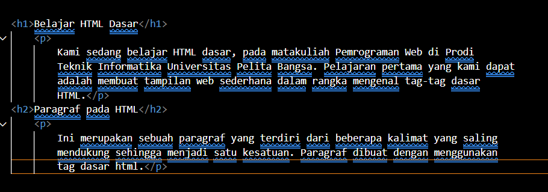
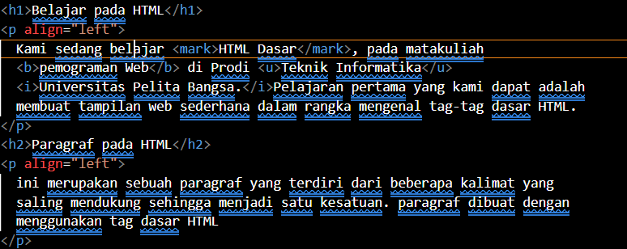
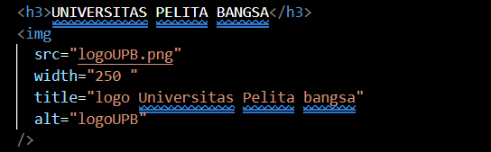

# Lab1Web.

# Pratikum 1 - HTML Dasar
### NAMA : M. Ridho Febrian
### NIM : 312410500
### KELAS : TI.24.A5

## 📍LANGKAH - LANGKAH PENGERJAAN

### 1. MEMBUAT FILE DASAR HTML.

```html
<!DOCTYPE html>
<html>
  <head>
    <title>Lab 1 – HTML Dasar</title>
  </head>
  <body>
    <!-- Konten HTML akan ditambahkan di sini -->
  </body>
</html>
```

📸 **SCREENSHOOT VSCODE DAN BROWSER**


<br>


## 2. CARA MEMBUAT PARAGRAF

```html
<!-- Ini adalah paragraf pertama --> 
<p>Kami sedang belajar HTML dasar, pada matakuliah Pemrograman Web di Prodi 
Teknik Informatika Universitas Pelita Bangsa. Pelajaran pertama yang kami dapat 
adalah membuat tampilan web sederhana dalam rangka mengenal tag-tag dasar 
HTML.</p> 
<!-- Ini adalah paragraf kedua --> 
<p>Ini merupakan sebuah paragraf yang terdiri dari beberapa kalimat yang saling 
mendukung sehingga menjadi satu kesatuan. Paragraf dibuat dengan menggunakan 
tag dasar html.</p>
```

### 3️. MENAMBAHKAN JUDUL & ISI

Tambahkan heading **h1** dan **h2** sebelum paragraf:

```html
<!-- judul paragraf pertama -->
<h1>Belajar Dasar HTML</h1>

<!-- judul paragraf kedua -->
<h2>Paragraf pada HTML</h2>
```

**CONTOH TAMPILAN JUDUL DAN ISI**




### 4. MEMFORMAT TEKS

Lakukan pemformatan teks pada paragraf, misalnya:

```html
<p align="center"><b>Teks ini tebal</b> dan <i>teks ini miring</i></p>
<p align="right">Ini adalah <sub>subscript</sub> dan <sup>superscript</sup></p>
```
**CONTOH TAMPILAN PEMFORMATAN TEKS**



### 5. MENAMBAHKAN GAMBAR

Simpan gambar pada folder yang sama, lalu tambahkan:

```html
<h3>Menambahkan Gambar</h3>

```

**CODE TAMPILKAM GAMBAR**




### 6️. MENAMBAHKAN HYPERLINK

Tambahkan link navigasi sebelum heading h1:

```html
<nav>
  <a href="lab1_tag_dasar.html">Dasar HTML</a>
  <a href="lab1_halaman2.html">Halaman 2</a>
  <a href="http://www.google.com" target="_blank"
    >Halaman Web Eksternal Google</a
  >
</nav>
<hr />
```

Buat file baru **`lab1_halaman2.html`** sebagai halaman kedua.

click bagian yang di tandai untuk berpindah ke halaman lain


**Halaman Kedua**


**Halaman Web Eksternal**


### 7. HASIL PRAKTIKUM


