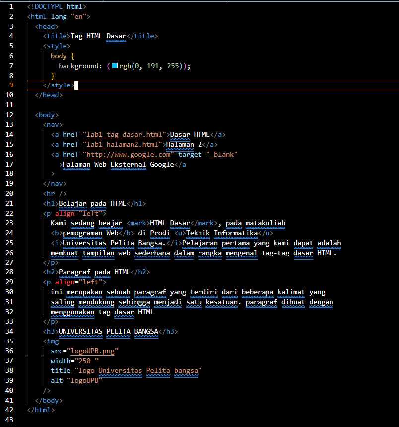
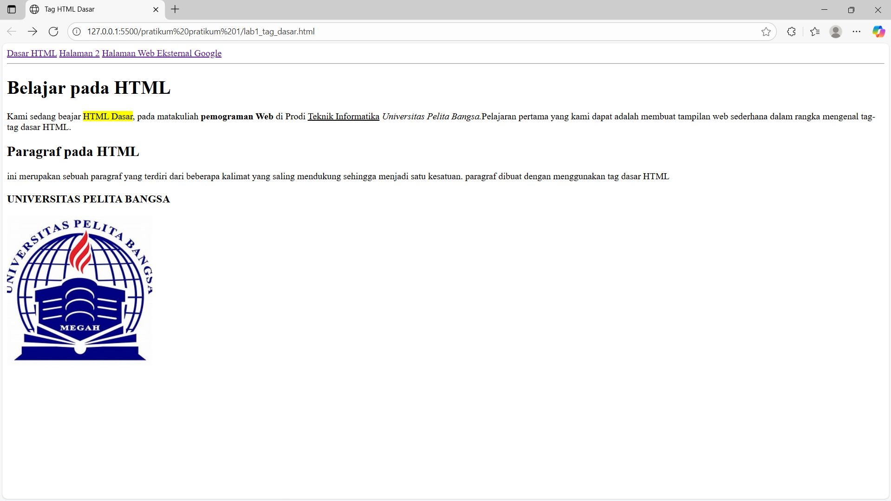
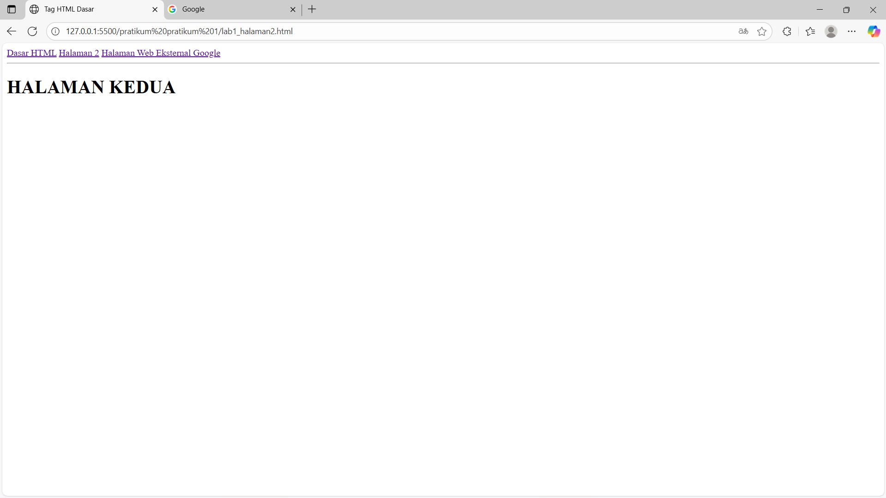

# Lab1Web.

# Pratikum 1 - HTML Dasar
### NAMA : M. Ridho Febrian
### NIM : 312410500
### KELAS : TI.24.A5

## 📍LANGKAH - LANGKAH PENGERJAAN

### 1. MEMBUAT FILE DASAR HTML.

```html
<!DOCTYPE html>
<html>
  <head>
    <title>Lab 1 – HTML Dasar</title>
  </head>
  <body>
    <!-- Konten HTML akan ditambahkan di sini -->
  </body>
</html>
```

📸 **SCREENSHOOT VSCODE DAN BROWSER/TAMPILAN**



<br>




## 2. CARA MEMBUAT PARAGRAF

```html
<!-- Ini adalah paragraf pertama --> 
<p>Kami sedang belajar HTML dasar, pada matakuliah Pemrograman Web di Prodi 
Teknik Informatika Universitas Pelita Bangsa. Pelajaran pertama yang kami dapat 
adalah membuat tampilan web sederhana dalam rangka mengenal tag-tag dasar 
HTML.</p> 
<!-- Ini adalah paragraf kedua --> 
<p>Ini merupakan sebuah paragraf yang terdiri dari beberapa kalimat yang saling 
mendukung sehingga menjadi satu kesatuan. Paragraf dibuat dengan menggunakan 
tag dasar html.</p>
```

### 3️. MENAMBAHKAN JUDUL & ISI

Tambahkan heading **h1** dan **h2** sebelum paragraf:

```html
<!-- judul paragraf pertama -->
<h1>Belajar Dasar HTML</h1>

<!-- judul paragraf kedua -->
<h2>Paragraf pada HTML</h2>
```

**CONTOH TAMPILAN JUDUL DAN ISI**


### 4. MEMFORMAT TEKS

Lakukan pemformatan teks pada paragraf, misalnya:

```html
<p align="center"><b>Teks ini tebal</b> dan <i>teks ini miring</i></p>
<p align="right">Ini adalah <sub>subscript</sub> dan <sup>superscript</sup></p>
```
**CONTOH TAMPILAN PEMFORMATAN TEKS**


### 5. MENAMBAHKAN GAMBAR

Simpan gambar pada folder yang sama, lalu tambahkan:

```html
<h3>Menambahkan Gambar</h3>

```

**CODE TAMPILKAM GAMBAR**


### 6️. MENAMBAHKAN HYPERLINK

Tambahkan link navigasi sebelum heading h1:

```html
<nav>
  <a href="lab1_tag_dasar.html">Dasar HTML</a>
  <a href="lab1_halaman2.html">Halaman 2</a>
  <a href="http://www.google.com" target="_blank"
    >Halaman Web Eksternal Google</a
  >
</nav>
<hr />
```

Buat file baru **`lab1_halaman2.html`** sebagai halaman kedua.

click bagian yang di tandai untuk berpindah ke halaman lain


**Halaman Kedua**



**Halaman Web Eksternal**


### 7. HASIL PRAKTIKUM


##  PERTANYAAN PRAKTIKUM

1. Adakah error ketika terjadi kesalahan penulisan tag?

2. Apa perbedaan tag `<p>` dengan `<br>`?

3. Apa perbedaan atribut `title` dan `alt` pada tag ``?

4. Agar proporsional, sebaiknya atribut width dan height diisi semua atau tidak? Jelaskan.

5. Apa perbedaan atribut `target` dengan nilai `_blank`, `_self`, `_top`, dan `_parent`?

## JAWABAN PRAKTIKUM

1. Jika terjadi kesalahan penulisan tag HTML (misal: `<pp>` bukan `<p>`, atau tag tidak ditutup), biasanya tampilannya jadi aneh. Bukan error kayak di bahasa pemrograman yang langsung berhenti, tapi hasil tampilan di browser bisa berantakan atau nggak sesuai yang kita maksud. Jadi browser tetep nampilin, cuma strukturnya bisa kacau.

2. `<p>` dipakai buat bikin paragraf baru, jadi ada jarak atas-bawah yang cukup jelas.
`<br>` dipakai buat bikin baris baru aja, tanpa jarak besar seperti paragraf.
Contoh: kalau nulis puisi atau alamat, biasanya pakai `<br>`, kalau nulis teks artikel biasanya pakai `<p>`.

3. `alt` itu teks alternatif, muncul kalau gambar gagal dimuat, dan juga penting buat aksesibilitas (misalnya dibaca sama screen reader).
`title` itu kayak tooltip, muncul kalau kita arahkan kursor ke gambar.
Jadi fungsi utamanya beda: `alt` lebih ke pengganti gambar, `title` lebih ke keterangan tambahan.

4. Kalau mau tetap proporsional, sebaiknya isi salah satu aja (misalnya width` aja atau `height` aja). Kalau isi dua-duanya tapi nggak sesuai rasio asli gambar, hasilnya bisa gepeng atau melebar. Jadi cara aman: isi salah satu, biar browser otomatis sesuaikan sisi lainnya.

5. `_blank` → buka link di tab/jendela baru.

   `_self` → buka link di tab/jendela yang sama (default).

   `_top` → buka link di jendela penuh, nutup semua frame kalau ada.

   `_parent` → buka link di frame induk (kalau ada struktur frame).
